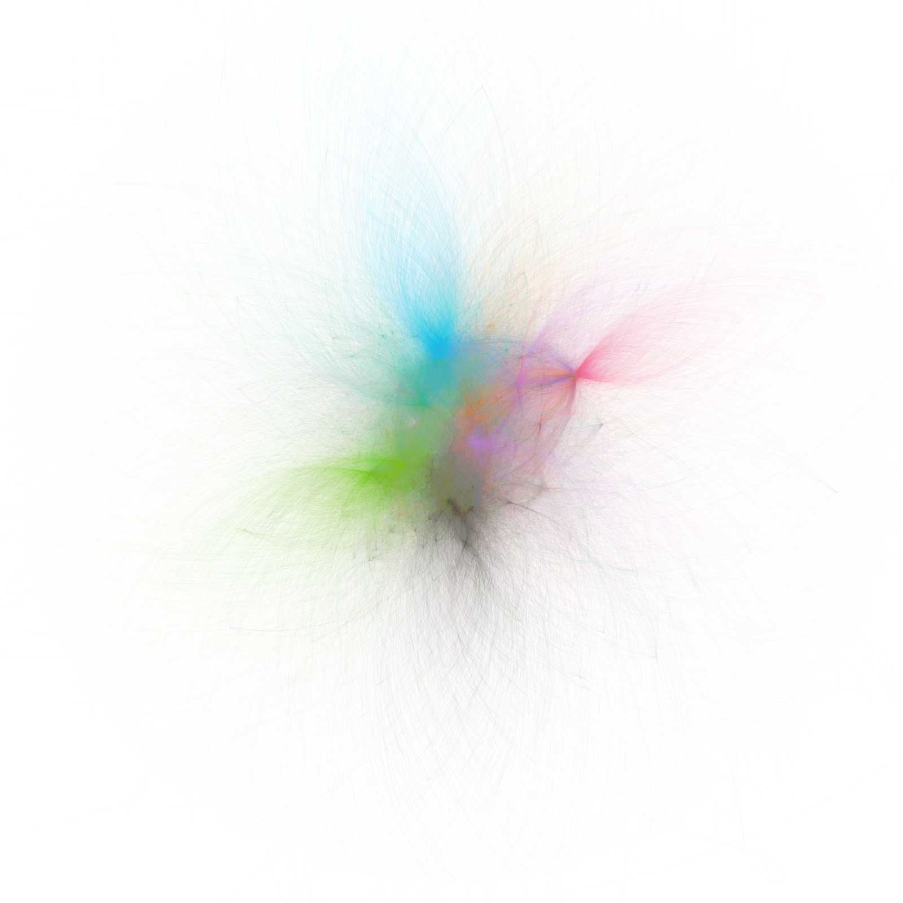
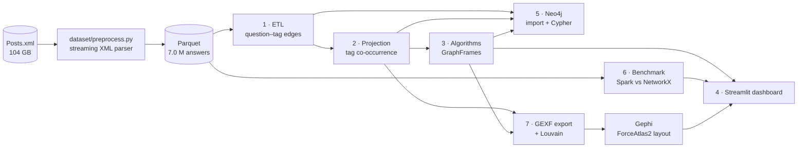
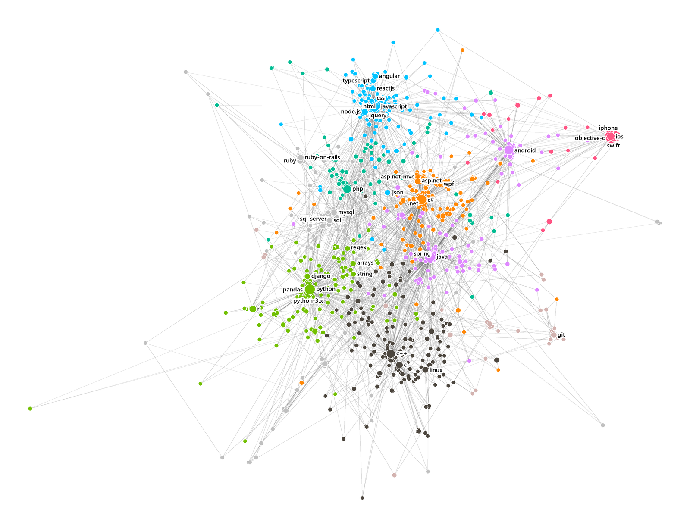
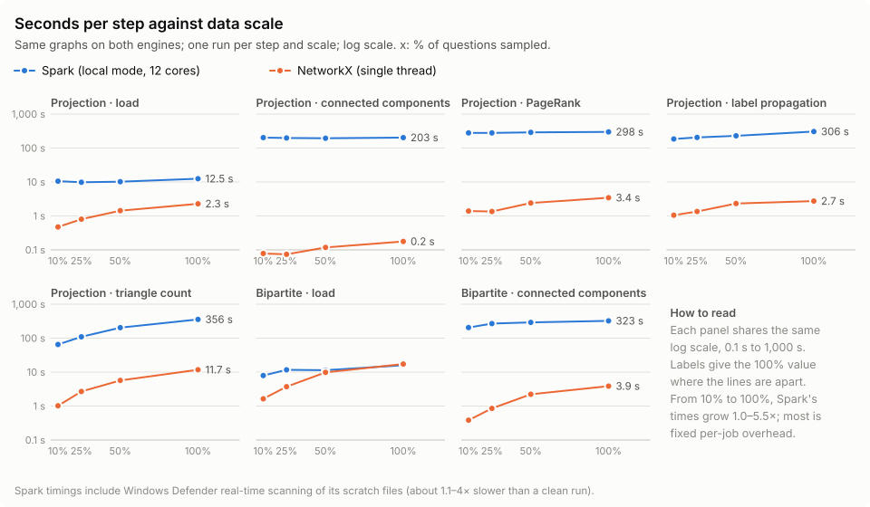

<div align="center">

# Stack Overflow Knowledge Graph Analytics

**Distributed graph processing over 2.5 million Stack Overflow questions and 49,372 technology tags**

[](https://www.python.org/)
[](https://spark.apache.org/)
[](https://graphframes.github.io/graphframes/)
[](https://neo4j.com/)
[![NetworkX](https://img.shields.io/badge/NetworkX-3.6-2C7FB8?logo=data:image/png;base64,iVBORw0KGgoAAAANSUhEUgAAABgAAAAYCAYAAADgdz34AAAE50lEQVR42q1WW2xUVRRd%2B5x7595Op5SSUKAQAqgFO1OigfBStEZ5FmPFdBIfBI2J1Q8jsSbalHJnBBEhJoZEwBo1wR%2Bc6kdBaBsbaH3wEhIKpUhBhWB4yKMttNOZe%2B852w9oKI3EVj1f5%2BesdfZZa%2B19CP%2FHclggBo5U1pYkAyM2pFlOyKLebzLdrhXyP4OXJiQ2RfQ0OaMwbQ6vnU5tYxbiJ30%2BMLGwi%2B18Y%2FBITKWJGvFbY4cIjcnn3LbLXFMT1Sg4znBYGG5tuDeUk%2F16cmtqNvZal1I57k48Ujw4AscRiBPXRKEAqNucTCirlqgmL1VRey6obmCzsczeo2ehxZ4ZyOhNN9DgwOMaAO6vqpsrie5lwT67%2Fsm2tU8eBIAHVu64z7cyP2MvlZuCdVHBuCcovL2SUxX0j%2BLFSYcrdxSRGXiPoCMm0TAGQ8G4prT6gXxVy1KsFEL2%2Bp5bPNZPdnYTRu5fFz0NAHcnYCYQccTZtRhkJqRpZqZ9xnVlaYKm4TJNUhK0UoqV2uP3ppae3FByY2D18m6CIgZMxZxcZk4YpjW6x9PeRH1OvED19CC143c9CkllKMM0DGh16sTa4i%2FgQKCpCQAEmpuA5seYbjotIY8fh8zIm8SHz%2B9Q0y7kycPVZV5BrGG5IcTnrg%2Fk0WXaiPUUxhEABpowFyvwFhQZIBBIubOOrl5yoL9mAGDAcURNNHqHO8wP91pwWAF1o00rU3Qo9mbimBlGOzyMAEGjCD9jMs6ihfMRgMc%2BiSkADgAxAHHcJojHdUHl9ofZsJ4AdDIAJPaXzzkDAMKpy1KexxZrcYrGI4kQgugEINCN4biCbAhoBhFB%2BR03IWN3PDYVOvXPKWlvMiwrmwGonq52ydzAhJks5ARBlAvlaxcmLaB9tBzbARA%2BxVLs5unalpqUUldFRij%2FWMXcjoFq0uRVjWfHGp3j16sN6V8xTjjGG6bp9%2FQy0U5W6iMI8bRhDytX6W7task2PAKYUjBhGSAyLHjpntdOxBdtAZgA4v4EhobItlU3j8MlI4WAlkIAoK2tsYWvAsC0Vw4dTI36E0LK8mBGAMqXYGbY7GmG7FDJ6%2BtOrC7%2BBHAEYuCBxqfIql2OtkKxMXwFabJw1bXTpt%2B9OMcY9n1zuIgRJQUAkaq62ZBiCTRPAThE0pivPLe1bU1xYYGTCABAW7zUG1gBAYSpsfqXk2w8L1h32JT8%2BGj8qd19QQOYwMDN%2Fa0AxmIUxuwfhTRnkPLnH40v2H1HhvqR0CBbKcFhQpy047CIx0kXrKorM%2B3gFk71HCLJO0F0uuWPc1%2Bhusy7fbk%2BAofFo2gSANCMJt0%2FKH%2FXPia9ncgOWlnbIM2FKZEBYYVgpq8BvvudD3rxZHzehb6qaWiDi0U8BoRRv14Gc8o52anmcAsC8NU%2BRAw3OFLoZNe21ncXPdt3RgxlLMaJdCHq8gi81E2neRm%2BxRaqkhupMvAmfUk3Ur4W4JJIReOoPj0GT3ArodqABQhbsMdT%2BAwBPgCBCbhIigUBLFn4gaFXEIsxmMn2%2FQtgPgYrJDbzM2oPitCIx7GGX1Ihk4khjhS0Xz9%2FyxtD06A0kZA10agKVzU8JALG14rM0d2eAIM5y2SS7Hayq0taV89v7uuq9G8%2FE5GK2qmw7Xck%2B%2FPAyASZTem0%2F8Ev7y%2FuA2cA%2FBfoyVWZ3jY3TQAAAABJRU5ErkJggg%3D%3D)](https://networkx.org/)
[![Gephi](https://img.shields.io/badge/Gephi-0.11-404040?logo=data:image/png;base64,iVBORw0KGgoAAAANSUhEUgAAABgAAAAYCAYAAADgdz34AAAGwUlEQVR42rVWW2xU1xVd53HnztgzHheYsQl2sEHEeBgbUNrED8wjcUObGKRKHUVR2hSlJFIorfrRChBSpqZyH4goJYCUUPGRqm2aEKmAIWkaXIIfYEwD5eUAY7u2w6T4NQZ77jzu3HN2P4wrSvrbJR2dcz7O2tLRXnsthgcQiUTE4cOHFQCsrl29EsBTgG4EKExgQQBgoFGAXQX4SQB%2FbT%2FbfvHBt7Ng91%2Bi0Shvbm7Wa2prw4DxE036WcOQbqUUiACAAACccxAROOdwlMpIJt7VZO85ffbs1VmOBwvM7tRQU%2F99LliLIV1Ftm2DiBRjjANgjDEwxmAlLUhDkmma2nEcwTkHGEZI086O7q5D9%2FOJewcOgFbV1L3qMlyvK0d5U1YqxwXnnHMOgHHOkcvlkMlkUL2iGoFgkBUU%2BLjH4yEppWNnswWc840lCxbQ8K3PT89y8kgkIgDoNXUNmySXzXfv3iW%2F368f%2FdqjhsfjYUQEIQRSVgpz5szBT3dsQ31DA7RWGOgfQCaTYaHwMgOM6VwuR4Y0mtfU1W0CoCORiGAA2Lr6ddWOtj9iYMEXN79Inrw83nq0FV%2FE49BaI5lMIlwVxvadO9BxugMH33wLXq8XVdVVEEJi8ZLFyMvLw3vvvKuTySQTUozynF5%2FqqfrsohEImL67tRurVTdK1u3OOXl5fK13XswOjIKzhmy2SxC4WX4xe5fofXIMex%2FYx8WLVqEUDiE673X8UU8DiEFpJQIBoOsv6%2FfMV1mgaOV97HamqN8NB6v0lptmPmWr8r9e%2FdhamoKbrcJpRT8fj9aftmC9k9O48C%2BA6iprUFtfS3OnT0Hy7IwPZ1ERcVStH%2FSjnQ6g0AgINPptOZCbIgPxqs4af40Y8xvmiZNjE%2BwGzduwOfzgYiQsiy8sOkFmG4PDryxH0sqlqBp4waMj01gMpGAbdtoanoGsVgMRcXFKPD7MTo6yqSUxBnzc8Gf5uBsHRFRJpNhfTdi8Pm80FqDiJDv9WL12rU43toKIQTWf2M9jh9rheGSqKhcilUNq%2BAoB71Xr8Hn8%2BLokSNg9%2FpZaUWcsXViYUnprzkXPsuymFIKDy8sRexmDESEsrKFWP%2FN9fh7z3kseeQR%2FO1kGwb6B%2BB2u1Hg96NyWQj9fX0wDANPND6JUCiEwaEhpFIpJqVkRNrDCSxIRJBS4vLlywDjeGZjE75SWAi%2FvxBCCDDG0PbxSSQSCbjdbnzW%2Bxmqly9HVXU17ty5g%2Be%2F912UlpZi88svYfPLL4GIZhZYkM9KmnMOzjk6T7fj5vUbqGtYBdPjxuDgED44fgK3%2F3UbdjaLwsJCNLfswpatW%2FCH3%2F0epmnC5%2FNh6ys%2FwN7Xf4OmjU3Iy8%2BDUjMjSd4bXPMBIGfbWL5yJQxDoqf7HPK8%2BTj65yNofOrruPDpp1i%2BYgWElCgo8GMyMYmuzk48953nMTw4BAYgHo8jm8nAZbiQSWfAQaMc4Nc455TL5XSwuBgVSytw69YtjI%2BNY1k4jFQqhb6bMZQvWoREYhKXLlzE%2FPnFGBgYAGlCcVERMpkMrKSFYDCIoeFhWJalOecExq9xTXRKcM6UUuTxuDE8PIzx8Qmk02kM%2FXMQdfX1uHrlKs52ncFHH36IylAlysrL4Xa7Yds25gXmIRaLQUiBJxqfROuRY7Asi1wuF9OgU6Jkfsk04%2Bw5KaWZmEigrLyM2VkbpseNH%2F74R%2FjHhYu4GbsJpRQCgQCaW36OD46fQCAYRFl5GYqKipC1s1i9dg3it%2BJ4%2F73DZJomAEw5ObVT1NTXjE3fmQq5DNdypZRjJS0Rrq6Cnc3iyuUr6OrshFYaPp8P23ZsQ2JiEruiP8P5nvMoKVmAxx5%2FHJ8PDaOroxNtJ9sghHBchks6jvP%2BQwsXHBS9vb1Y%2FNDD%2FQ7pb0kpfdPT02RZSRYOV2F0ZARz581FIBDAt5%2BNIDE5idd274FpmhgZGUE6nUHF0gr89q2D6O%2FrR35%2BvuacC6XUqNTYcuLjv9zmkUiEn%2BrpusQY2w6AuVwuNj42rttOtmHO3LkoKS3FvMA8%2FOmP72D%2F3n3%2FaWfGGCpDlWCMY2xsDP5CvyaiWSFvP9XTdSkSiXB2n%2BHo1TV1r3IhmwFAa51Lp9NSa80YYzBNE4ZhQOsZN7RtG0srK1FQ4KPuM91OvjffICJo5UTbu8%2FsmuX8n5bJOFoM6SpSSoFAioFxImI0Y8yzIKWUJiLh8XiQy9kjRPiSZc4qmQBQNBrlHd1dhxjpRien3lZKZwQXYob8v7MCY4yZpimklBknp95m0I0d3V2HotEon%2BX7Uqr4f8SWfwMJ%2FTAz%2FDGxjgAAAABJRU5ErkJggg%3D%3D)](https://gephi.org/)
[](https://streamlit.io/)
[](https://plotly.com/python/)
[](https://parquet.apache.org/)
[](https://archive.org/details/stackexchange)



<sub><b>The technology map.</b> 25,597 Stack Overflow tags joined by 215,968 co-occurrence edges (weight ≥ 5), laid out with ForceAtlas2 in Gephi.<br>Colour: Louvain cluster. Size: tag authority (PageRank).</sub>

*Minor project · Big Data Analytics specialization · Department of Computer Science & Engineering*

</div>

---

## Contents

- [Overview](#overview)
- [Objectives and status](#objectives-and-status)
- [Dataset](#dataset)
- [Architecture](#architecture)
- [Tech stack](#tech-stack)
- [Method](#method)
- [Results](#results)
- [Conclusions](#conclusions)
- [Limitations and future work](#limitations-and-future-work)
- [The dashboard](#the-dashboard)
- [Getting started](#getting-started)
- [Testing](#testing)
- [Repository structure](#repository-structure)
- [Team](#team)
- [Acknowledgements and references](#acknowledgements-and-references)

## Overview

Stack Overflow's public data dump records which technologies developers use together, but only implicitly. Every question carries up to five tags, and nothing in the XML says how those tags relate to each other. This project turns that record into a graph and analyses it at scale.

From 7.0 million answer rows it builds a **question–tag bipartite graph** of 2.58 million vertices and 7.78 million edges. It then projects that onto a **tag co-occurrence graph**: two tags are linked when they appear on the same question, weighted by how often they do. On top of these two graphs it:

- ranks technologies by **tag authority** (PageRank), and finds **communities** (Label Propagation), **isolated sub-networks** (Connected Components) and **clustering density** (Triangle Count) with Spark GraphFrames;
- loads the full graph into **Neo4j** for interactive Cypher queries;
- **benchmarks** Spark against single-machine NetworkX on identical graphs at four data scales;
- lays the technology map out in **Gephi** and serves every result through a five-tab **Streamlit** dashboard.

### At a glance

| | |
|---|---|
| Questions analysed | **2,532,514**, with 6,997,182 answers |
| Distinct tags | **49,372** |
| Question–tag edges | **7,775,852** |
| Tag co-occurrence edges | **1,469,065**, of which 215,968 have weight ≥ 5 |
| Most central technologies | **java**, python, c#, javascript, android |
| Technology clusters (Louvain) | **64**; the largest, Java and Android, holds 4,174 tags |
| Spark vs NetworkX at full scale | NetworkX ran every algorithm **30× to 1,146× faster** |
| Automated tests | **71 passing** |

## Objectives and status

The [synopsis](Synopsis.md) set six objectives. The preprocessed data carries no user identifier and no timestamps, so its user-centred parts could not be built. See [Limitations](#limitations-and-future-work).

| # | Objective | What was built |
|:-:|---|---|
| 1 | ETL from the XML dump to Parquet | A streaming XML preprocessor (`dataset/`) turns `Posts.xml` into Parquet. A PySpark stage builds the graph's node and edge tables from it. |
| 2 | Multi-relational knowledge graph | Question–tagged-with–Tag (7.78M edges) and the Tag–Tag projection (1.47M edges). User–answers–Question and User–votes–Post need `OwnerUserId`, which the data lacks. |
| 3 | Graph analytics with GraphFrames | PageRank, Label Propagation, Connected Components and Triangle Count on the tag graph; Connected Components on the bipartite graph. PageRank ranks technologies, not users. |
| 4 | Neo4j and Cypher | 2,581,886 nodes and 9,244,917 relationships bulk-imported in 16 s. Shortest-path, bridge-tag and stack-completion queries. |
| 5 | Gephi and Streamlit visualisation | A Gephi ForceAtlas2 layout and a five-tab dashboard. The expert leaderboard and trend charts need user IDs and dates. |
| 6 | Benchmark against NetworkX | Hashed 10 / 25 / 50 / 100 % question samples instead of 1 / 5 / 10 GB XML subsets. The result contradicts the synopsis's hypothesis: see [the benchmark](#spark-vs-networkx). |


## Dataset

- **Source.** The Stack Exchange [data dump](https://archive.org/details/stackexchange) for stackoverflow.com. `Posts.xml` alone is **104 GB** uncompressed.
- **Preprocessing** (`dataset/`). A two-pass, multi-process streaming parser reads the XML with `xml.etree.ElementTree`, never as a whole document. It splits the file into byte ranges, indexes questions on the first pass, joins answers to them on the second, and writes Parquet in 50,000-row batches. It was first written for a separate retrieval-augmented-generation project, which is why it also extracts prose, code snippets and image URLs.
- **Input to the graph pipeline.** One Parquet file of 6.93 GB with **6,997,182 rows, one per answer**. The graph stages read only four of its columns (`question_id`, `tags`, `score`, `answer_score`), so a full read costs a few hundred MB rather than 6.93 GB.

The raw and processed data (about 41 GB) are not in the repository.

## Architecture



| Stage | Script (in `graph/`) | Engine | Output | Runtime |
|---|---|---|---|---|
| 0 · Smoke test | `stage0_smoke.py` | Spark | Checks the JDK, Spark and all four GraphFrames algorithms on a toy graph | 2–9 min |
| 1 · ETL | `stage1_etl.py` | Spark | Question nodes, tag nodes, question–tag edges | ~4 min |
| 2 · Projection | `stage2_projection.py` | Spark | Tag–tag co-occurrence edges, stored once per pair | ~2 min |
| 3 · Algorithms | `stage3_algorithms.py` | Spark + GraphFrames | `tag_metrics`, the threshold sweep, bipartite components | ~5 min; ~27 min with the sweep |
| 4 · Dashboard | `dashboard/app.py` | Streamlit | Five interactive tabs. Reads results only; no Spark at runtime | — |
| 5 · Graph database | `stage5_neo4j_export.py`, `stage5_neo4j_queries.py` | Neo4j | Bulk-import CSVs, a count check and four Cypher queries | ~25 s, 16 s import, ~11 s |
| 6 · Benchmark | `stage6_benchmark.py` | Spark vs NetworkX | `benchmark.csv`, `benchmark_checks.csv` | ~1.5 h |
| 7 · Gephi export | `stage7_gephi_export.py` | NetworkX | `tag_graph.gexf` and the Louvain clusters | ~7 s, then the layout by hand in Gephi |

Every stage writes its artifacts under `graph/out/` and can be re-run on its own.

## Tech stack

| | Layer | Technology | Role |
|:-:|---|---|---|
|  | Language | Python 3.11 | Everything. PySpark 3.5.3 does not run on Python 3.12. |
|  | Processing | Apache Spark 3.5.3 (PySpark), local mode | ETL, projection, distributed algorithms |
|  | Graph analytics | GraphFrames 0.8.4 | PageRank, Label Propagation, Connected Components, Triangle Count |
|  | Storage | Apache Parquet, PyArrow | Columnar artifacts between stages |
|  | Graph database | Neo4j Community 5.26 LTS, Cypher | Bulk import and interactive queries |
|  | Single-machine graphs | NetworkX 3.6, SciPy | Benchmark baseline, Louvain clustering, GEXF export |
|  | Network visualisation | Gephi 0.11 | ForceAtlas2 layout and the static map |
|  | Dashboard | Streamlit 1.62 | Five-tab interactive dashboard |
|  | Charts | Plotly 7.0 | Dashboard charts and the WebGL network view |
|  | Data frames | pandas 2.3 | Small result tables |
|  | Runtime | Eclipse Temurin JDK 17 | The JVM under Spark and Neo4j |
|  | Testing | pytest | 71 tests |

## Method

### Graph model

- **Bipartite graph.** `Question —TAGGED_WITH→ Tag`: 2,532,514 question vertices, 49,372 tag vertices and 7,775,852 edges.
- **Tag co-occurrence projection.** `Tag — Tag`, where the weight is the number of questions that carry both tags. Spark builds it with a self-join and stores each pair once. It has 1,469,065 edges.
- **Weight threshold.** The algorithms run on the edges with weight ≥ 5: 215,968 edges between 25,597 tags. A sweep at thresholds 1, 5 and 20 checks how sensitive the results are to that choice.

### Algorithms

| Algorithm | Graph | Measures | Notes |
|---|---|---|---|
| PageRank | Projection | **Tag authority**: how central a technology is | 20 iterations, reset probability 0.15. Runs on symmetrised edges, since the projection stores each pair once. |
| Label Propagation | Projection | Technology communities | 10 iterations. Labels are vertex IDs, not 0…n. |
| Connected Components | Both | Isolated sub-networks | |
| Triangle Count | Projection only | Clustering density | A bipartite graph has no triangles, so running it there would always give zero. |
| Louvain (NetworkX) | Projection | Clusters for colouring the map | Weighted, `seed=42`. Used for the picture only: LPA stays the community result. |

GraphFrames' PageRank and Label Propagation ignore edge weights, so weight enters them only through the threshold. PageRank here ranks **technologies, not people**: the data has no user identifier.

## Results

### The graph

| Quantity | Value |
|---|---|
| Bipartite vertices | 2,581,886, exactly 2,532,514 questions + 49,372 tags |
| Bipartite connected components | 119. The giant component holds 2,581,620 vertices (99.99%). The other 118 are tiny: 106 single question–tag pairs and 12 fragments of 3 to 12 vertices. |
| Tags with an edge at weight ≥ 1 | 49,260. The other 112 only ever appeared alone on a question. |
| Tags at weight ≥ 5 | 25,597, in 34 connected components (the giant one has 25,524) |
| Triangles at weight ≥ 5 | 2,566,685 |

### Tag authority

The ten most central technologies, by PageRank over the weight ≥ 5 projection:

| Rank | Tag | Tag authority | Questions |
|:-:|---|--:|--:|
| 1 | java | 358.4 | 213,850 |
| 2 | python | 340.6 | 229,355 |
| 3 | c# | 323.8 | 215,512 |
| 4 | javascript | 295.0 | 222,067 |
| 5 | android | 264.4 | 136,833 |
| 6 | c++ | 215.0 | 132,053 |
| 7 | php | 177.3 | 107,364 |
| 8 | ios | 155.8 | 76,911 |
| 9 | .net | 127.1 | 65,760 |
| 10 | r | 111.1 | 58,850 |

Authority follows volume at the top, but not everywhere. Among the 5,956 tags with at least 100 questions, these rank thousands of places higher by authority than by volume. They are linked to many well-connected technologies relative to how often they are asked about:

| Tag | Authority rank | Volume rank | Places gained | Questions |
|---|--:|--:|--:|--:|
| openstack | 2,232 | 5,901 | 3,669 | 101 |
| theorem-proving | 2,355 | 5,859 | 3,504 | 102 |
| microsoft-dynamics | 2,713 | 5,748 | 3,035 | 105 |
| parser-generator | 2,800 | 5,538 | 2,738 | 111 |
| bittorrent | 2,145 | 4,823 | 2,678 | 138 |
| olap | 2,578 | 5,057 | 2,479 | 128 |

Without the 100-question floor this comparison is noise. Thousands of rarely used tags tie at the PageRank floor of 1.0, and the tie hands all of them the same rank.

### Communities

**Label Propagation finds one giant community.** At weight ≥ 5 it puts 25,348 of 25,597 tags (99.0%) into a single community. The next largest holds 37 tags (`ethereum`, `solidity` and their neighbours). Raising the threshold barely changes this:

| Threshold | Tags | LPA communities | Largest community |
|:-:|--:|--:|--:|
| weight ≥ 1 | 49,260 | 24 | 99.9% |
| weight ≥ 5 | 25,597 | 111 | 99.0% |
| weight ≥ 20 | 11,768 | 116 | 92.4% |

**Weighted Louvain shows the structure inside that core.** It splits the weight ≥ 5 graph into 64 clusters that read as technology stacks:

| Cluster | Tags | Most-asked members |
|:-:|--:|---|
| 0 | 4,174 | java, android, spring, multithreading, xml |
| 1 | 3,625 | python, r, arrays, django, regex |
| 2 | 3,532 | javascript, html, jquery, css, node.js |
| 3 | 3,164 | c++, c, linux, windows, bash |
| 4 | 3,102 | c#, .net, asp.net, asp.net-mvc, wpf |
| 5 | 1,869 | ios, objective-c, swift, iphone, xcode |
| 6 | 1,720 | php, laravel, security, http, symfony |
| 7 | 1,268 | git, amazon-web-services, docker, go, github |

### The technology map

The map at the top of this page is the whole weight ≥ 5 graph as Gephi draws it. The dashboard's **Network** tab redraws the same layout interactively. Below is its default view, rendered as a static image: the 1,000 most-asked tags at Gephi's positions and colours, with each tag's three strongest links, 2,755 edges in all.

<p align="center">
  
</p>

The stacks separate cleanly:
- the web front end at the top;
- .NET at the centre, with Java just below it and Android to the upper right;
- Python and data analysis to the lower left;
- C, C++ and Linux at the bottom;
- the Apple platforms on the right edge.

General-purpose tags such as `json`, `regex`, `arrays` and `string` sit between the language clusters.

### Neo4j queries

All four queries run against the full graph: 2,581,886 nodes and 9,244,917 relationships.

| Query | Result |
|---|---|
| Shortest path between two technologies, `solidity` → `haskell` | `solidity` –5– `arrays` –75– `haskell`. It crosses from the Ethereum community into the giant one; there is no direct edge. |
| Bridge tags: the tags linked to the most other LPA communities | `javascript` (5), `python` (4), `c#` (3) |
| Questions tagged with both `python` and `docker`, by score | Led by question 45594707: score 353, 6 answers |
| Stack completion for `python` + `docker` | `linux`, `java`, `postgresql`, `ubuntu`, `amazon-web-services`, `php` |

Stack completion ranks each candidate tag by its weaker link to the pair, so a tag tied strongly to only one of the two does not float to the top.

### Spark vs NetworkX

Both engines ran the same graphs at four scales, chosen by a hashed sample of 10, 25, 50 and 100% of the questions. The projection is benchmarked unthresholded (weight ≥ 1): sampling scales every weight down, so a fixed threshold would confuse graph size with sampling rate.

<p align="center">
  <picture>
    <source media="(prefers-color-scheme: dark)" srcset="docs/images/benchmark_dark.svg">
    
  </picture>
</p>

| Step, at 100% | Spark | NetworkX | NetworkX faster by |
|---|--:|--:|--:|
| Projection · load | 12.5 s | 2.3 s | 5.5× |
| Projection · connected components | 202.9 s | 0.18 s | 1,146× |
| Projection · PageRank | 298.3 s | 3.4 s | 87× |
| Projection · label propagation | 306.3 s | 2.7 s | 112× |
| Projection · triangle count | 356.3 s | 11.7 s | 30× |
| Bipartite · load | 16.0 s | 17.3 s | 0.9× (Spark faster) |
| Bipartite · connected components | 323.5 s | 3.9 s | 84× |

| Scale | Bipartite vertices | Bipartite edges | Projection vertices | Projection edges |
|:-:|--:|--:|--:|--:|
| 10% | 281,565 | 779,777 | 27,691 | 318,859 |
| 25% | 669,618 | 1,943,388 | 36,463 | 599,044 |
| 50% | 1,310,277 | 3,891,169 | 43,267 | 949,301 |
| 100% | 2,581,886 | 7,775,852 | 49,260 | 1,469,065 |

- **The two engines agree.** All 28 exact cross-engine checks match: vertex counts, edge counts, component counts and triangle counts, at every scale. PageRank rankings correlate at Spearman 0.9997–0.9999. NetworkX never timed out. Its peak memory was 2.4 GB on the bipartite graph and 0.76 GB on the projection.
- **Setup.** Spark ran in local mode on one machine with 12 logical cores, 15.7 GB of RAM and an 8 GB driver; NetworkX is single-threaded. There was one run per step and scale.
- **Caveat.** Windows Defender's real-time scanning of Spark's scratch files inflated these Spark timings 1.1–4× compared with an earlier, clean run. The conclusion does not change: in that clean run, PageRank took 74 s at full scale, still more than 20× slower than NetworkX.

## Conclusions

1. **Stack Overflow's technologies form one dense core, not separate islands.** Label Propagation puts 99% of the tags into a single community, and still 92% at weight ≥ 20. The structure inside that core shows only under a weighted method: Louvain finds 64 clusters that match recognisable stacks, such as Java and Android, Python and data, the web front end, C and C++ systems, .NET, the Apple platforms, PHP and DevOps.
2. **Centrality is mostly volume, with telling exceptions.** The top of the tag-authority ranking matches the most-asked tags. Some niche tags, such as `openstack`, `theorem-proving` and `olap`, rank thousands of places higher by authority than by volume.
3. **The general-purpose languages carry the bridges.** `javascript`, `python` and `c#` touch the most other communities. The shortest route from the niche `solidity` community into the rest of the graph runs through `arrays`.
4. **At this size, one machine beats Spark.** The graphs here reach 2.58 million vertices and 7.78 million edges. On them, single-threaded NetworkX ran every algorithm 30× to 1,146× faster than Spark in local mode, with identical results. While the data grew tenfold, Spark's time per step grew only 1.0–5.5×, so fixed per-job overhead dominates. That suggests distributed processing pays off only once a graph outgrows one machine's memory. NetworkX peaked at 2.4 GB here, so this dataset is nowhere near that point.
5. **A graph database suits the exploratory questions.** Neo4j imported the full graph in 16 seconds and answers path and neighbourhood queries in seconds. Those queries are awkward to express as Spark jobs.

## Limitations and future work

- **No users, no time.** The preprocessed data has no `OwnerUserId` and no `CreationDate`. That blocks four things:
  - the user graph (User–answers–Question, User–votes–Post);
  - PageRank over users and the expert leaderboard;
  - the comparison with reputation scores;
  - any temporal trend analysis.

  `Users.xml` has been extracted, but the Parquet would need re-extracting with those fields. The dump's published schema fills `Votes.UserId` only for favourites and bounties, so up- and down-vote edges may not be buildable at all.
- **Unweighted algorithms.** GraphFrames' PageRank and Label Propagation ignore weights; weight enters only through the threshold. A weighted PageRank via `aggregateMessages` is future work.
- **One machine, not a cluster.** Spark ran in local mode, and its timings carry the Defender overhead described above. A run on a real cluster, and on graphs larger than one machine's memory, is the natural next experiment.
- **Scale by sample, not by bytes.** The benchmark scales by question sample, not by 1 / 5 / 10 GB XML subsets. XML parsing happens before Spark, so it is outside the timings.
- **Reproducing the input.** An earlier revision of `dataset/`, which kept every answer, produced the Parquet used here. The committed preprocessor keeps only accepted answers, so it will not regenerate the same file.

## The dashboard

`streamlit run graph/dashboard/app.py` opens five tabs. The dashboard reads only the small result tables, with no Spark at runtime.

| Tab | Shows |
|---|---|
| **Tag authority** | Authority against question volume, and the tags "punching above their volume" |
| **Communities** | Each LPA community with its most central tags |
| **Co-occurrence** | A heatmap of co-occurrence among the top N tags |
| **Network** | Gephi's image, then an interactive WebGL view at Gephi's positions: the top N tags (100–5,000) and each tag's k strongest edges (1–10). Below that, a filtered edge table. |
| **Benchmark** | Spark vs NetworkX timings by scale, graph sizes and the cross-engine checks |

## Getting started

### Prerequisites

The pipeline was built and tested on Windows 11. You need:

- **Python 3.11.** PySpark 3.5.3's bundled cloudpickle predates 3.12, and on 3.12 every Spark worker crashes without a traceback.
- **JDK 17** (Eclipse Temurin), with `JAVA_HOME` set.
- **Hadoop's `winutils.exe` and `hadoop.dll`** (3.3.5) in `C:\hadoop\bin`, with `HADOOP_HOME=C:\hadoop`.
- **About 16 GB of RAM**, since the Spark driver gets 8 GB. Spark's scratch space goes to `C:\spark-tmp` unless `SPARK_SCRATCH` says otherwise.
- **Network access on the first run.** The GraphFrames JAR comes from `repos.spark-packages.org`.
- **Optional:** [Neo4j Community 5.26 LTS](https://neo4j.com/deployment-center/) and [Gephi 0.11](https://gephi.org/users/download/). For Neo4j, take 5.26, the last line that runs on Java 17, not the newest calendar release, which needs Java 21.

### Install

```powershell
git clone https://github.com/StrikerEureka34/BDA_Minor_Project.git
cd BDA_Minor_Project
py -3.11 -m venv .venv
.venv\Scripts\python.exe -m pip install -r graph\requirements.txt
cd graph
..\.venv\Scripts\python.exe stage0_smoke.py      # must end with "STAGE 0 PASSED"
```

### Run the pipeline

Run these from `graph/`, always with the venv's interpreter. Stage 1 reads `..\dataset\Datasets_2nd run\preprocessed_posts.parquet` by default; pass `--input` to point it elsewhere.

```powershell
..\.venv\Scripts\python.exe stage1_etl.py                          # ~4 min
..\.venv\Scripts\python.exe stage2_projection.py                   # ~2 min
..\.venv\Scripts\python.exe stage3_algorithms.py --bipartite       # ~30 min; add --skip-sweep for the primary threshold only
..\.venv\Scripts\python.exe stage7_gephi_export.py                 # ~7 s, writes out/gephi/tag_graph.gexf
..\.venv\Scripts\streamlit.exe run dashboard\app.py --server.address localhost
```

<details>
<summary><b>Neo4j: export, import and queries</b></summary>

The server must be **stopped** for the import and **running** for the queries. Never run it alongside Spark: an 8 GB Spark driver and Neo4j do not fit together in 16 GB of RAM.

```powershell
..\.venv\Scripts\python.exe stage5_neo4j_export.py                 # CSVs in out\neo4j_import
$imp = (Resolve-Path out\neo4j_import).Path
& "$env:NEO4J_HOME\bin\neo4j-admin.bat" database import full neo4j `
    --nodes=Tag="$imp\tags.csv" --nodes=Question="$imp\questions.csv" `
    --relationships=TAGGED_WITH="$imp\tagged_with.csv" --relationships=CO_OCCURS="$imp\co_occurs.csv" `
    --overwrite-destination=true --report-file="$env:NEO4J_HOME\logs\import.report"
& "$env:NEO4J_HOME\bin\neo4j.bat" console                          # leave running
$env:NEO4J_PASSWORD = "<your password>"
..\.venv\Scripts\python.exe stage5_neo4j_queries.py                # count check + 4 queries
```
</details>

<details>
<summary><b>Benchmark: Spark vs NetworkX</b></summary>

Stop Neo4j and close memory-heavy applications first. Each worker runs in its own process.

```powershell
..\.venv\Scripts\python.exe stage6_benchmark.py --scales 10        # smoke test, ~8 min; all 7 exact checks must read "match"
..\.venv\Scripts\python.exe stage6_benchmark.py                    # full 10/25/50/100% run, ~1.5 h
```
</details>

<details>
<summary><b>Gephi: laying out the map</b></summary>

1. Open `graph/out/gephi/tag_graph.gexf`. Check that it reports an undirected graph with 25,597 nodes and 215,968 edges.
2. In Appearance, colour the nodes by partition on `louvain_cluster`. Size them by ranking on `tag_authority`, from 2 to 40.
3. Run ForceAtlas 2 (Barnes-Hut on, LinLog on, Scaling 10, Gravity 1) until the layout settles, then Prevent Overlap.
4. In Preview, turn node labels off and set edge thickness to 0.1 with opacity about 15. Export `tag_graph.png` (4000 × 4000) and `tag_graph.svg`.
5. Export the graph as GEXF, with positions, colours, sizes and attributes, to `graph/out/gephi/tag_graph_layout.gexf`. The dashboard's Network tab reads this file.
</details>

## Testing

```powershell
cd graph
..\.venv\Scripts\python.exe -m pytest tests/ -v        # 71 tests, ~11 min (they start a local Spark session)
```

| File | Tests | Covers |
|---|--:|---|
| `test_etl.py` | 13 | Question aggregation, tag explode, hashed sampling |
| `test_projection.py` | 6 | The co-occurrence self-join |
| `test_algorithms.py` | 11 | Thresholding, symmetrisation, vertex derivation |
| `test_session.py` | 2 | Windows Hadoop setup, loopback binding |
| `test_neo4j_export.py` | 8 | CSV headers, empty metrics, labels up to 4×10¹¹ written as integers |
| `test_bench.py` | 10 | Benchmark records, timeouts, cross-checks, the Parquet reader |
| `test_nx_algorithms.py` | 5 | NetworkX baseline, and agreement with Spark on a toy graph |
| `test_gephi.py` | 15 | GEXF types, Louvain, GEXF 1.2 and 1.3 layouts, the network view |
| `test_requirements.py` | 1 | Every third-party import is pinned in `requirements.txt` |

## Repository structure

```text
BDA_Minor_Project/
├── Synopsis.md               project proposal (objectives 1–6)
├── dataset/                  streaming XML → Parquet preprocessor
│   ├── preprocess.py         orchestrates chunking, two-pass scan, finalize
│   ├── PREPROCESS.md
│   └── lib/                  chunker, phase 1–3, HTML parser, finalize
├── graph/                    graph analytics pipeline
│   ├── stage0_smoke.py … stage7_gephi_export.py
│   ├── bench_spark.py, bench_networkx.py    benchmark workers
│   ├── lib/                  session, etl, projection, algorithms, cypher,
│   │                         neo4j_export, bench, nx_algorithms, gephi
│   ├── dashboard/app.py      Streamlit dashboard
│   ├── tests/                71 pytest tests
│   └── requirements.txt
├── docs/images/              figures for this README
└── submissions/              synopsis, presentations, progress review
```

Generated artifacts go to `graph/out/`, which is git-ignored.

## Team

| | |
|---|---|
| **Om Dhondge** | [@Om-Dhondge](https://github.com/Om-Dhondge) |
| **Ayush Kumar** | [@StrikerEureka34](https://github.com/StrikerEureka34) |
| **Guide** | Dr. Mayur Pandya |

Minor Specialization in Big Data Analytics, Department of Computer Science & Engineering.

## Acknowledgements and references

Data: the [Stack Exchange data dump](https://archive.org/details/stackexchange), published by Stack Exchange, Inc. under [CC BY-SA 4.0](https://creativecommons.org/licenses/by-sa/4.0/).

1. S. Brin and L. Page, "The anatomy of a large-scale hypertextual Web search engine," *Computer Networks and ISDN Systems*, vol. 30, no. 1–7, pp. 107–117, 1998.
2. U. N. Raghavan, R. Albert and S. Kumara, "Near linear time algorithm to detect community structures in large-scale networks," *Physical Review E*, vol. 76, 036106, 2007.
3. V. D. Blondel, J.-L. Guillaume, R. Lambiotte and E. Lefebvre, "Fast unfolding of communities in large networks," *J. Stat. Mech.*, P10008, 2008.
4. A. Dave, A. Jindal, L. E. Li, R. Xin, J. Gonzalez and M. Zaharia, "GraphFrames: an integrated API for mixing graph and relational queries," in *Proc. GRADES*, ACM, 2016.
5. M. Jacomy, T. Venturini, S. Heymann and M. Bastian, "ForceAtlas2, a continuous graph layout algorithm for handy network visualization designed for the Gephi software," *PLoS ONE*, vol. 9, no. 6, e98679, 2014.
